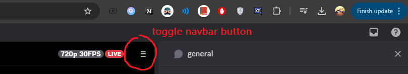

# Discord Navbar Toggle

A simple Chrome extension that adds a toggle button to hide/show Discord's left sidebar, giving you more screen space when needed.

## Features

- Adds a minimal toggle button (≡) to Discord's top toolbar
- Click to instantly hide/show the left navigation bar
- Seamlessly integrates with Discord's native design
- Works automatically when Discord loads

## Installation

1. Download and unzip this extension
2. Go to `chrome://extensions/`
3. Enable "Developer mode" in the top right
4. Click "Load unpacked" and select the extension folder

## Usage

After installation, you'll see a new toggle button in Discord's top toolbar:

Simply click the button to hide/show the left sidebar. Click again to restore it.

**Note:** If the toggle button doesn't appear immediately after installation, try reloading your Discord tab.

## License

MIT License

